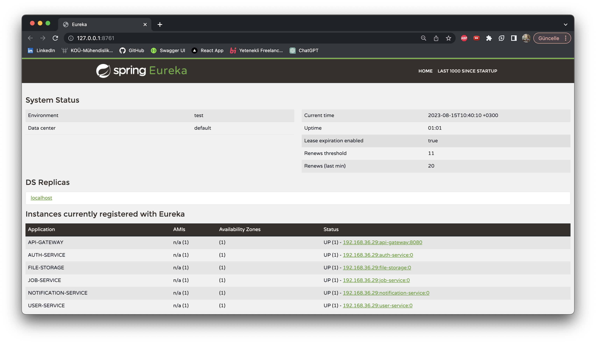
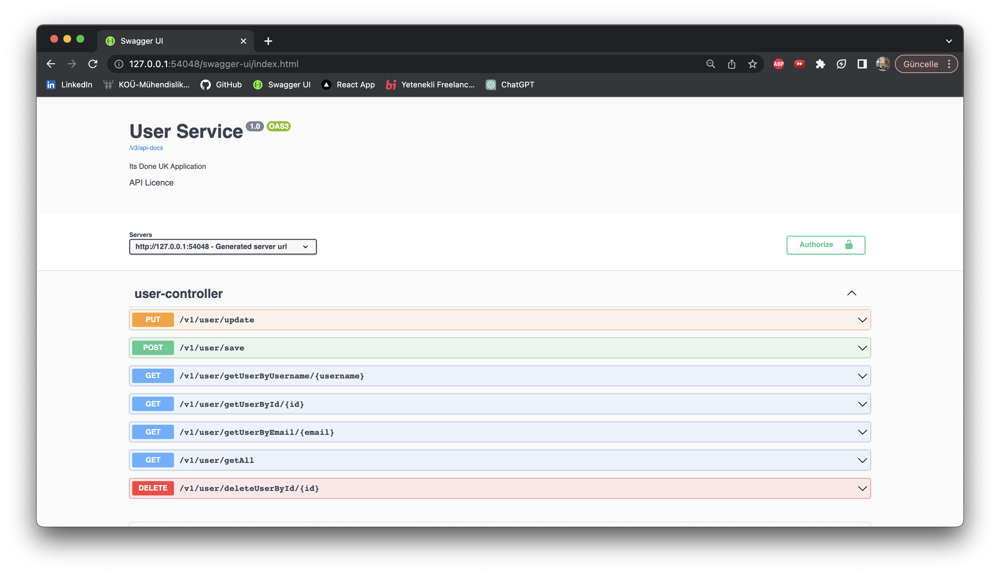
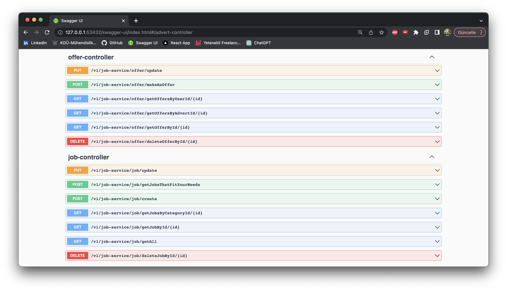
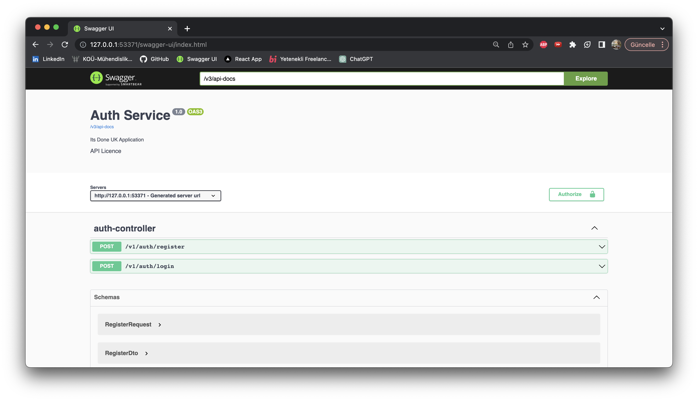
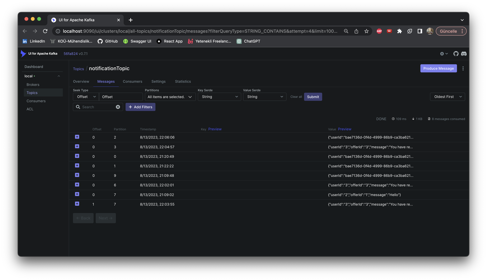
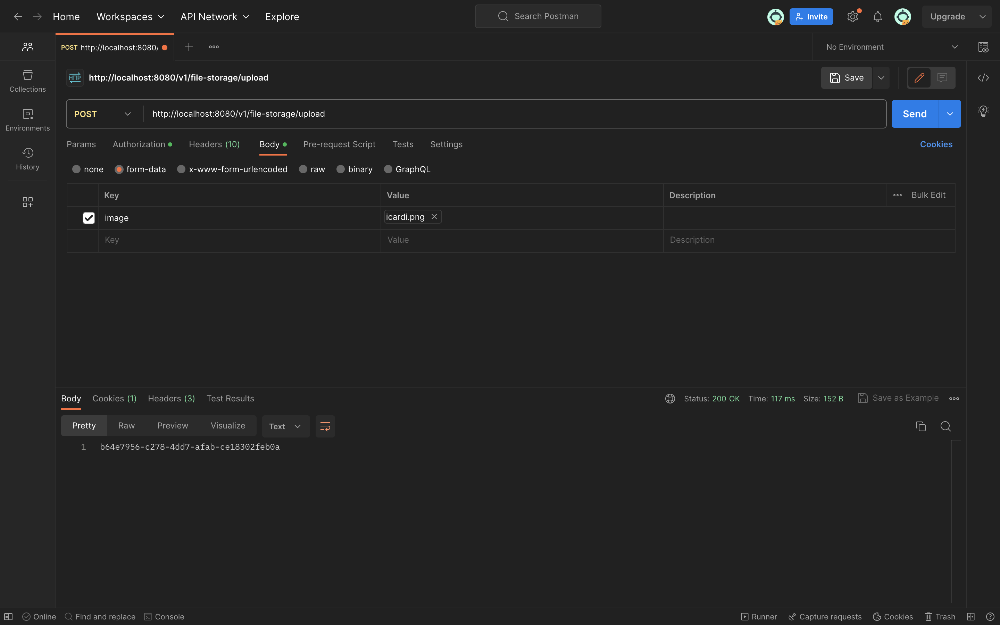

# Spring Boot Microservices Project
(Eureka Server, Config Server, API Gateway, Kafka, File Storage, JWT, Authentication, Authorization, Redis, Docker)

# About the project

<ul style="list-style-type:disc">
  <li>This project is based Spring Boot Microservices</li>
  <li>User can register and login through auth service by user role (ADMIN or USER) through api gateway</li>
  <li>User can send any request to relevant service through api gateway with its bearer token</li>
</ul>

8 services whose name are shown below have been devised within the scope of this project.

- Config Server
- Eureka Server
- API Gateway
- Auth Service
- Job Service
- User Service
- Notification Service
- File Storage


### Used Dependencies

* Core
    * Spring
        * Spring Boot
        * Spring Security
            * Spring Security JWT
            * Authentication
            * Authorization
        * Spring Web
            * FeighClient
        * Spring Data
            * Spring Data JPA
            * PostgreSQL
        * Spring Cloud
            * Spring Cloud Gateway Server
            * Spring Cloud Config Server
            * Spring Cloud Config Client
    * Netflix
        * Eureka Server
        * Eureka Client
* Database
    * PostgreSQL
* Kafka
* Redis
* Docker 
* Validation
* File storage
* Modelmapper
* Openapi UI
* Lombok
* Log4j2


### Explore Rest APIs

<table style="width:100%">
  <tr>
      <th>Method</th>
      <th>Url</th>
      <th>Description</th>
      <th>Valid Request Body</th>
      <th>Valid Request Params</th>
  </tr>
  <tr>
      <td>POST</td>
      <td>/v1/auth/register</td>
      <td>Register for User</td>
      <td><a href="#register">Info</a></td>
      <td></td>
  </tr>
  <tr>
      <td>POST</td>
      <td>/v1/auth/login</td>
      <td>Login for User and Admin</td>
      <td><a href="#login">Info</a></td>
      <td></td>
  </tr>
  <tr>
      <td>GET</td>
      <td>/v1/user/getAll</td>
      <td>Get all user</td>
      <td></td>
      <td></td>
  </tr>
  <tr>
      <td>GET</td>
      <td>/v1/user/getUserById/{id}</td>
      <td>Get user by id</td>
      <td></td>
      <td><a href="#getUserById">Info</a></td>
  </tr>
 <tr>
      <td>GET</td>
      <td>/v1/user/getUserByEmail/{email}</td>
      <td>Get user by email</td>
      <td></td>
      <td><a href="#getUserByEmail">Info</a></td>
  </tr>
 <tr>
      <td>PUT</td>
      <td>/v1/user/update</td>
      <td>Update user</td>
      <td><a href="#updateUser">Info</a></td>
      <td></td>
  </tr>
  <tr>
      <td>DELETE</td>
      <td>/v1/user/deleteUserById/{id}</td>
      <td>Delete user by id</td>
      <td></td>
      <td><a href="#deleteUserById">Info</a></td>
  </tr>
  <tr>
      <td>POST</td>
      <td>/v1/job-service/category/create</td>
      <td>Category create</td>
      <td><a href="#categoryCreate">Info</a></td>
      <td></td>
  </tr>
  <tr>
      <td>GET</td>
      <td>/v1/job-service/category/getAll</td>
      <td>Get all categories</td>
      <td></td>
      <td></td>
  </tr>
  <tr>
      <td>GET</td>
      <td>/v1/job-service/category/getCategoryById/{id}</td>
      <td>Get category by id</td>
      <td></td>
      <td><a href="#getCategoryById">Info</a></td>
  </tr>
 <tr>
      <td>PUT</td>
      <td>/v1/job-service/category/update</td>
      <td>Update category</td>
      <td><a href="#updateCategory">Info</a></td>
      <td></td>
  </tr>
  <tr>
      <td>DELETE</td>
      <td>/v1/job-service/category/deleteCategoryById/{id}</td>
      <td>Delete category</td>
      <td></td>
      <td><a href="#deleteCategoryById">Info</a></td>
  </tr>
   <tr>
      <td>POST</td>
      <td>/v1/job-service/job/create</td>
      <td>Job create</td>
      <td><a href="#jobCreate">Info</a></td>
      <td></td>
  </tr>
   <tr>
      <td>POST</td>
      <td>/v1/job-service/job/getJobsThatFitYourNeeds</td>
      <td>Get jobs that fit your needs</td>
      <td><a href="#getJobsThatFitYourNeeds">Info</a></td>
      <td></td>
  </tr>
  <tr>
      <td>GET</td>
      <td>/v1/job-service/job/getAll</td>
      <td>Get all jobs</td>
      <td></td>
      <td></td>
  </tr>
  <tr>
      <td>GET</td>
      <td>/v1/job-service/job/getJobById/{id}</td>
      <td>Get job by id</td>
      <td></td>
      <td><a href="#getJobById">Info</a></td>
  </tr>
 <tr>
      <td>PUT</td>
      <td>/v1/job-service/job/update</td>
      <td>Update job</td>
      <td><a href="#updateJob">Info</a></td>
      <td></td>
  </tr>
  <tr>
      <td>DELETE</td>
      <td>/v1/job-service/job/deleteJobById/{id}</td>
      <td>Delete job</td>
      <td></td>
      <td><a href="#deleteJobById">Info</a></td>
  </tr>
<tr>
      <td>POST</td>
      <td>/v1/job-service/advert/create</td>
      <td>Adver create</td>
      <td><a href="#advertCreate">Info</a></td>
      <td></td>
  </tr>
  <tr>
      <td>GET</td>
      <td>/v1/job-service/advert/getAll</td>
      <td>Get all adverts</td>
      <td></td>
      <td></td>
  </tr>
  <tr>
      <td>GET</td>
      <td>/v1/job-service/advert/getAdvertById/{id}</td>
      <td>Get advert by id</td>
      <td></td>
      <td><a href="#getAdvertById">Info</a></td>
  </tr>
 <tr>
      <td>GET</td>
      <td>/v1/job-service/advert/getAdvertsByUserId/{id}</td>
      <td>Get advert by user id</td>
      <td></td>
      <td><a href="#getAdvertsByUserId">Info</a></td>
  </tr>
 <tr>
      <td>PUT</td>
      <td>/v1/job-service/advert/update</td>
      <td>Update advert</td>
      <td><a href="#updateAdvert">Info</a></td>
      <td></td>
  </tr>
  <tr>
      <td>DELETE</td>
      <td>/v1/job-service/advert/deleteAdvertById/{id}</td>
      <td>Delete advert</td>
      <td></td>
      <td><a href="#deleteAdvertById">Info</a></td>
  </tr>
 <tr>
      <td>POST</td>
      <td>/v1/job-service/offer/makeAnOffer</td>
      <td>Make an offer</td>
      <td><a href="#makeAnOffer">Info</a></td>
      <td></td>
  </tr>
  <tr>
      <td>GET</td>
      <td>/v1/job-service/offer/getOfferById/{id}</td>
      <td>Get offer by id</td>
      <td></td>
      <td><a href="#getOfferById">Info</a></td>
  </tr>
 <tr>
      <td>GET</td>
      <td>/v1/job-service/offer/getOfferByUserId/{id}</td>
      <td>Get offer by user id</td>
      <td></td>
      <td><a href="#getOfferByUserId">Info</a></td>
  </tr>
 <tr>
      <td>GET</td>
      <td>/v1/job-service/offer/getOfferByAdvertId/{id}</td>
      <td>Get offer by advert id</td>
      <td></td>
      <td><a href="#getOfferByAdvertId">Info</a></td>
  </tr>
 <tr>
      <td>PUT</td>
      <td>/v1/job-service/offer/update</td>
      <td>Update offer</td>
      <td><a href="#updateOffer">Info</a></td>
      <td></td>
  </tr>
  <tr>
      <td>DELETE</td>
      <td>/v1/job-service/offer/deleteOfferById/{id}</td>
      <td>Delete offer</td>
      <td></td>
      <td><a href="#deleteOfferById">Info</a></td>
  </tr>
 <tr>
      <td>GET</td>
      <td>/v1/notification/getAllByUserId/{userId}}</td>
      <td>Get all notification by user id</td>
      <td></td>
      <td><a href="#getAllNotificationByUserId">Info</a></td>
  </tr>
 <tr>
      <td>GET</td>
      <td>/v1/file-storage/download/{id}</td>
      <td>Download image to file storage</td>
      <td></td>
      <td><a href="#downloadImage">Info</a></td>
  </tr>
</table>

## Valid Request Body

##### <a id="register"> Register for User

``` 
    http://localhost:8080/v1/auth/register
    
        {
          "username": "string",
          "password": "string",
          "email": "string"
        }
```

##### <a id="login"> Login for User and Admin

```
      http://localhost:8080/v1/auth/login
    
       {
         "username": "string",
         "password": "string"
       }
```

##### <a id="updateUser"> Update User

```
    http://localhost:8080/v1/user/update
    
    form-data:
        {
          "request": {
            "id": "string",
            "username": "string",
            "password": "string",
            "userDetails": {
              "firstName": "string",
              "lastName": "string",
              "phoneNumber": "string",
              "country": "string",
              "city": "string",
              "address": "string",
              "postalCode": "string",
              "aboutMe": "string",
              "profilePicture": "string"
            }
           },
         "file": "string"
        }
    
    Bearer Token : Authorized User or Admin
```

##### <a id="categoryCreate"> Create Category

``` 
    http://localhost:8080/v1/job-service/category/create
    
    form data:
    {
      "request": {
        "name": "string",
        "description": "string"
      },
      "file": "string"
    }
    
    Bearer Token : Admin Token
```

##### <a id="updateCategory"> Update Category

``` 
    http://localhost:8080/v1/job-service/category/updateCategory
    
    form data:
    {
      "request": {
        "id": "string",
        "name": "string",
        "description": "string"
      },
      "file": "string"
    }
    
    Bearer Token : Admin Token
```

##### <a id="jobCreate"> Create Job

``` 
    http://localhost:8080/v1/job-service/job/create
    
    form data:
       {
      "request": {
        "name": "string",
        "description": "string",
        "categoryId": "string",
        "keys": [
          "string"
        ]
      },
      "file": "string"
    }
    
    Bearer Token : Admin Token
```

##### <a id="updateJob"> Update Job

``` 
    http://localhost:8080/v1/job-service/job/updateJob
    
    form data:
     {
      "request": {
        "id": "string",
        "name": "string",
        "description": "string",
        "categoryId": "string",
        "keys": [
          "string"
        ]
      },
      "file": "string"
    }
        
    Bearer Token : Admin Token
```

##### <a id="advertCreate"> Create Advert

``` 
    http://localhost:8080/v1/job-service/advert/create
    
    form data:
     {
      "request": {
        "name": "string",
        "description": "string",
        "deliveryTime": 0,
        "price": 0,
        "advertiser": "EMPLOYEE",
        "userId": "string",
        "jobId": "string"
      },
      "file": "string"
    }
    
    Bearer Token : User Token
```

##### <a id="updateAdvert"> Update Advert

``` 
    http://localhost:8080/v1/job-service/advert/update
    
    form data:
    {
      "request": {
        "id": "string",
        "name": "string",
        "description": "string",
        "deliveryTime": 0,
        "price": 0,
        "status": "OPEN"
      },
      "file": "string"
    }
        
    Bearer Token : Authorized User or Admin
```

##### <a id="makeAnOffer"> Make An Offer

``` 
    http://localhost:8080/v1/job-service/offer/makeAnOffer
    
    {
      "userId": "string",
      "advertId": "string",
      "offeredPrice": 0
    }
    
    Bearer Token : User Token
```

##### <a id="updateOffer"> Update Offer

``` 
    http://localhost:8080/v1/job-service/offer/update
    
    {
      "id": "string",
      "offeredPrice": 0,
      "status": "OPEN"
    }
        
    Bearer Token : Authorized User or Admin
```


## Valid Request Params

##### <a id="getUserById"> Get User By Id

```
    http://localhost:8080/v1/user/getUserById/{id}
    
    Bearer Token : User Token
```

##### <a id="getUserByEmail"> Get User By Email

```
    http://localhost:8080/v1/user/getUserByEmail/{email}
    
    Bearer Token : User Token
```

##### <a id="deleteUserById">Delete User By Id

``` 
    http://localhost:8080/v1/user/deleteUserById/{id}
    
    Bearer Token : Authorized User or Admin
```

##### <a id="getCategoryById"> Get Category By Id

``` 
    http://localhost:8080/v1/job-service/category/getCategoryById/{id}
    
    Bearer Token : User Token
```

##### <a id="deleteCategoryById">Delete Category By Id

``` 
    http://localhost:8080/v1/job-service/category/deleteCategoryById/{id}
    
    Bearer Token : Admin Token
```

##### <a id="getJobById"> Get Job By Id

``` 
    http://localhost:8080/v1/job-service/job/getJobById/{id}
    
    Bearer Token : User Token
```

##### <a id="getJobsThatFitYourNeeds"> Get Jobs That Fit Your Needs

``` 
    http://localhost:8080/v1/job-service/job/getJobsThatFitYourNeeds/{needs}
   
    Bearer Token : User Token
```

##### <a id="deleteJobById">Delete Job By Id

``` 
    http://localhost:8080/v1/job-service/job/deleteJobById/{id}
    
    Bearer Token : Admin Token
```

##### <a id="getAdvertById"> Get Advert By Id

``` 
    http://localhost:8080/v1/job-service/advert/getAdvertById/{id}
    
    Bearer Token : Authorized User or Admin
```

##### <a id="getAdvertsByUserId"> Get Advert By User Id

``` 
    http://localhost:8080/v1/job-service/advert/getAdvertByUserId/{id}
    
    Bearer Token : User Token
```

##### <a id="deleteAdvertById">Delete Advert By Id

``` 
    http://localhost:8080/v1/job-service/job/deleteAdvertById/{id}
    
    Bearer Token : Authorized User or Admin
```

##### <a id="getOfferById"> Get Offer By Id

``` 
    http://localhost:8080/v1/job-service/offer/getOfferById/{id}
    
    Bearer Token : User Token
```

##### <a id="getOfferByUserId"> Get Offer By User Id

``` 
    http://localhost:8080/v1/job-service/offer/getOfferByUserId/{id}
    
    Bearer Token : User Token
```

##### <a id="getOfferByAdvertId"> Get Offer By Advert Id

``` 
    http://localhost:8080/v1/job-service/offer/getOfferByAdvertId/{id}
    
    Bearer Token : User Token
```

##### <a id="deleteOfferById">Delete Offer By Id

``` 
    http://localhost:8080/v1/job-service/offer/deleteOfferById/{id}
    
    Bearer Token : Authorized User or Admin
```

##### <a id="getAllNotificationByUserId">Get All Notification By User Id

``` 
    http://localhost:8080/v1/notification/getAllByUserId/{id}
    
    Bearer Token : Authorized User or Admin
```

##### <a id="downloadImage">Download Image to File Storage

``` 
    http://localhost:8080/v1/file-storage/download/{id}
    
    Bearer Token : User Token
```


### 🔨 Run the App

<b>Local</b>

<b>1 )</b> Clone project `git clone https://github.com/devsyx/spring-boot-microservices.git`

<b>2 )</b> Go to the project's home directory :  `cd spring-boot-microservices`

<b>3 )</b> Run docker compose <b>`docker compose up`</b></b>

<b>4 )</b> Run <b>Eureka Server</b>

<b>5 )</b> Run <b>Gateway</b>

<b>6 )</b> Run <b>Config Server</b>

<b>7 )</b> Run other services (<b>auth-service</b>, <b>user-service</b>, <b>job-service</b>, <b>notification-service</b>  and lastly <b>
file-storage</b>)

<b>8 )</b> For swagger ui localhost:8080/v1/{service-name}/swagger-ui/index.html</b>


### Screenshots

<details>
<summary>Click here to show the screenshot of project</summary>
    <p> Eureka Server</p>
    
    <p>User Service Swagger UI</p>
    
    <p>Job Service Swagger UI</p>
    
    
    <p> Auth Service Swagger UI </p>
    
    <p>Notification Kafka UI</p>
    
    <p>File Storage Postman</p>
    
    
</details>
